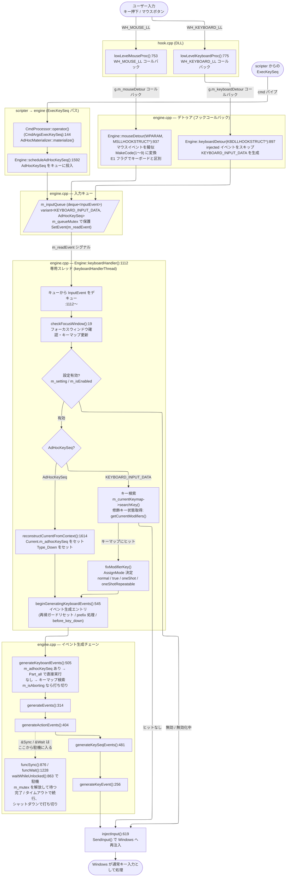
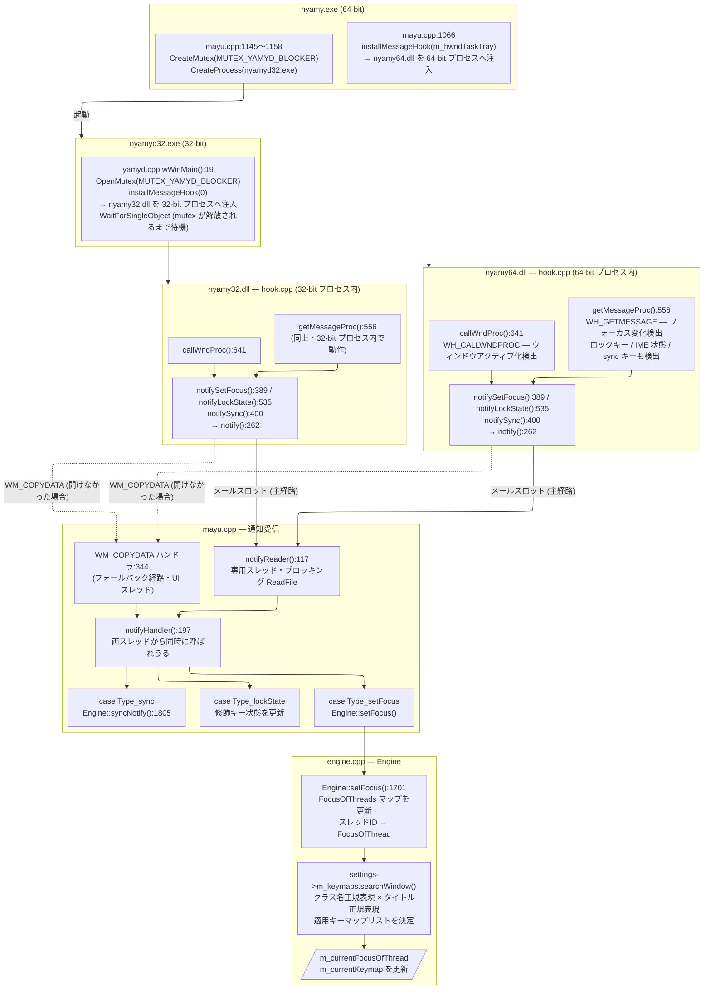
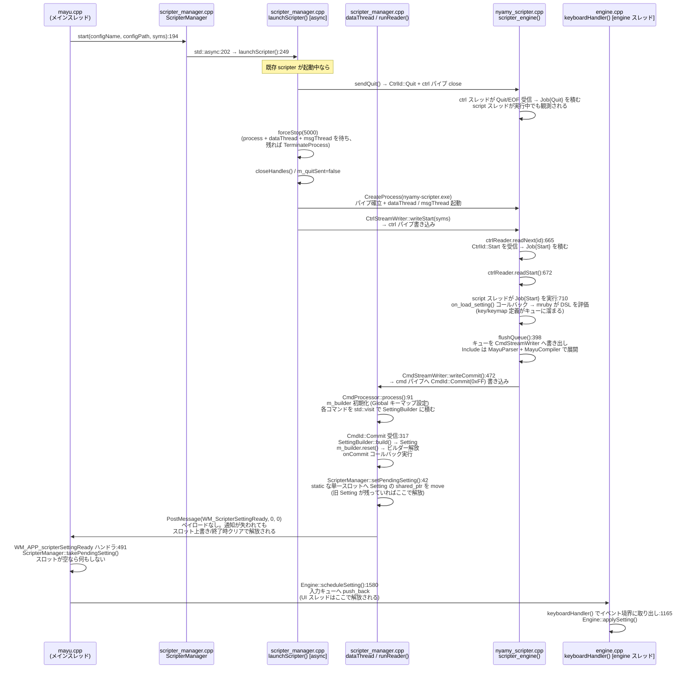
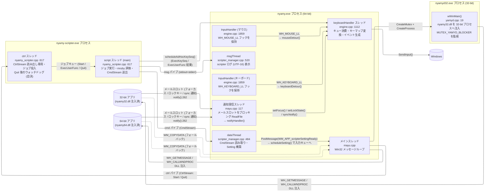
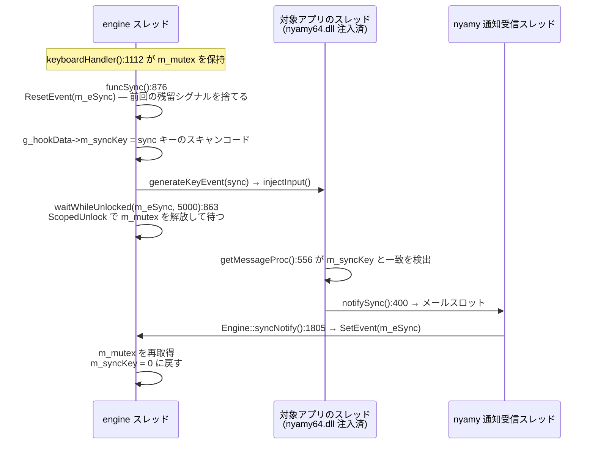
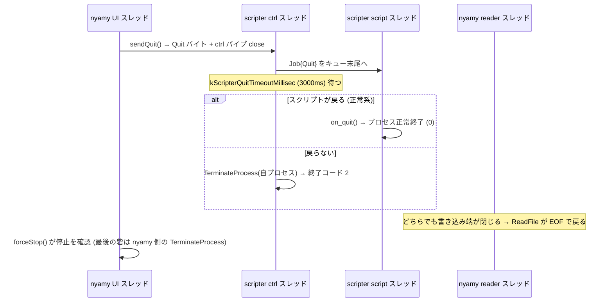

# Engine イベント処理フロー

Engine を中心としたキーボード/マウスイベントの処理フローと、設定再読み込みフローを示す。

---

## 1. キーボード/マウス入力フロー

### 擬似マウス MakeCode 対応表

| MakeCode | 意味 |
|----------|------|
| 1 | 左クリック |
| 2 | 右クリック |
| 3 | 中クリック |
| 4 | ホイール上 |
| 5 | ホイール下 |
| 6 | XButton1 |
| 7 | XButton2 |
| 8 | 水平ホイール左 |
| 9 | 水平ホイール右 |

### ExecKeySeq と通常キーの処理比較

| 処理 | 通常キー | ExecKeySeq |
|------|----------|-----------|
| キューの型 | `KEYBOARD_INPUT_DATA` | `AdHocKeySeq` |
| キーマップ検索 | `searchKey()` で実施 | `m_adhocKeySeq` オーバーライドでスキップ |
| 再帰ガードリセット | `beginGeneratingKeyboardEvents` で実施 | 同上 (共有) |
| `before_key_down` 発火 | `beginGeneratingKeyboardEvents` で実施 | 同上 (共有) |
| prefix キー状態管理 | `beginGeneratingKeyboardEvents` で実施 | 同上 (共有) |
| `m_emacsEditKillLine` リセット | `beginGeneratingKeyboardEvents` で実施 | 同上 (共有) |
| キーマップ base リセット | `beginGeneratingKeyboardEvents` で実施 | 同上 (共有) |
| modifier / oneShot 処理 | `keyboardHandler` 通常パスで実施 | 非適用 |
| `generateKeySeqEvents` の Part | Down / Up (物理押下に応じて) | `Part_all` |

---

## 2. フォーカス追跡フロー

WH_GETMESSAGE / WH_CALLWNDPROC フックは **グローバルフック** (threadId=0) であり、
フックを登録したプロセスのビット数に対応した DLL がフック対象プロセスに注入される。

- **nyamy.exe (64-bit)** が `installMessageHook()` を呼ぶ → **nyamy64.dll** が 64-bit プロセスに注入
- **nyamyd32.exe (32-bit)** が `installMessageHook(0)` を呼ぶ → **nyamy32.dll** が 32-bit プロセスに注入

どちらの DLL も同じ hook.cpp を共有しており、フォーカス変化を **メールスロット** で nyamy.exe へ送る。

### 通知チャネル

`notify()` (hook.cpp:262) が全通知の送出口で、経路は 2 つある。

| 経路 | 使用条件 | 性質 |
|---|---|---|
| メールスロット `NOTIFY_MAILSLOT_NAME` | 主経路。DLL 初期化時に `CreateFile` で開けた場合 | 非同期・ブロックしない |
| `WM_COPYDATA` + `SendMessageTimeout` | メールスロットを開けなかった場合のフォールバック | **同期**。相手が応答するまで送信元が止まる |

送信元は任意アプリのメッセージフック内 (`getMessageProc()`) なので、ここでブロックすると
**対象アプリのメッセージループが止まる**。これが経路選択を縛る最優先の制約で、
フォールバックが同期であることは既知の弱点である。

`Notify::Type` は 10 種 (setFocus / name / lockState / sync / threadAttach / threadDetach /
command32 / command64 / show / log) あり、すべて同じ経路を通る。

受信側は **専用スレッド** (`notifyReader()`, mayu.cpp:117) がメールスロットを
ブロッキング `ReadFile` で読み、`notifyHandler()` へ渡す。UI スレッドの
完了ルーチン (APC) ではない — APC はそのスレッドがアラータブル待ちに戻っている間しか
配送されず、タスクトレイメニューやモーダルダイアログの表示中は通知が滞留するため
(詳細は「5. `&Sync` / `&Wait` の同期待ち」)。したがって `notifyHandler()` は
受信スレッドと、フォールバック経由で UI スレッドから、同時に呼ばれうる。

### nyamyd32 のライフサイクル

| フェーズ | 処理 |
|--------|------|
| 起動 | `OpenMutex(MUTEX_YAMYD_BLOCKER)` が成功した場合のみ動作 (nyamy.exe が保持) |
| 動作中 | `installMessageHook(0)` → nyamy32.dll を 32-bit プロセスへグローバル注入 |
| 終了 | nyamy.exe が `ReleaseMutex()` → `WaitForSingleObject` が解除 → `uninstallMessageHook()` して終了 |

---

## 3. 設定再読み込みフロー

設定リロード時は scripter プロセスを再起動する。
`ScripterManager::start()` は `std::async` で `launchScripter()` を起動し、即座に返る。
初回起動時も同じ `start()` を呼ぶ（mayu.cpp:781）。

UI スレッドで直接 `m_setting` を差し替えず、engine スレッドの入力キュー
(`InputEvent` variant) に載せてイベント境界で適用する。これにより

- キューに溜まった旧設定下のキーイベントより後に切り替わる
- `&Sync` / `&Wait` の同期中を待つ必要がなくなる (取り出し地点では
  `m_isSynchronizing` が必ず false)。適用中に Setting が差し替わらないため、
  キーシーケンスが保持している `Key*` / `Keymap*` が宙に浮かない
- UI スレッドがメッセージループへ即座に戻る

### Engine::applySetting() の内部処理 (engine.cpp :1526)

---

## 4. スレッド構成

通知受信スレッドから `T_handler` への矢印は、engine の状態を `m_mutex` 越しに更新する
という意味であり、スレッド間の起床ではない。`syncNotify()` だけは例外で、
`&Sync` で駐機している engine スレッドを `m_eSync` で起こす (「5. `&Sync` / `&Wait`
の同期待ち」参照)。

### スレッドごとの停止手段

| スレッド | 停止のさせ方 | 備考 |
|---|---|---|
| 通知受信 | `CancelIoEx()` で `ReadFile` を解除 | 確認できなければハンドルを閉じずスレッドも残す |
| InputHandler × 2 | `postQuit()` (WM_QUIT) | フックを保持しているため最優先で止める |
| keyboardHandler | `m_isStopping` + `SetEvent(m_readEvent)` 駐機中なら `m_eShutdown` | 2 経路あるのは `&Sync` / `&Wait` で駐機しうるため |
| dataThread / msgThread | 書き込み端 (scripter プロセス) を閉じる | 同期匿名パイプの `ReadFile` は `CancelIoEx` が効かない |

---

## 5. `&Sync` / `&Wait` の同期待ち

`&Sync` は「対象アプリが、いま送ったキーをメッセージループで受け取るまで待つ」機能である。
engine スレッドがキーシーケンスの途中で止まり、3 スレッド・2 プロセスをまたいだ通知が
返ってくるのを待つ。nyamy で最も同期の絡む箇所であり、扱いを誤ると
全キー入力が数秒止まる。

### なぜ m_mutex を手放すのか

sync 通知は `Engine::syncNotify()` を通り、そこは `m_mutex` を取る。engine スレッドが
握ったまま待つと、通知が永久に届かない。そのため `waitWhileUnlocked()` が待っている間だけ
解放する。

この解放窓が成立する条件は `m_isSynchronizing` の宣言 (engine.h:291) にまとめてある。要点:

- engine スレッドは駐機中に何も触らないので、`m_mutex` が守る状態は一貫したまま
- `setFocus()` / `setLockState()` / `setShow()` はこのフラグを見て **false を返し通知を捨てる**。
  再送はない。フォーカスは `checkFocusWindow()` が次のイベントで再導出するので復帰するが、
  ロック状態は次のロックキーまで古いまま残る
- `applySetting()` は同じ engine スレッドのイベントループからしか到達しないため走れない

`m_mutex` は `recursive_mutex` である。**深度 2 以上で `funcSync()` に到達すると
`unlock()` が解放にならず**、通知が届かないまま黙って固まる。`ScopedUnlock` (engine.h:227) が
深度 1 を ASSERT するのはこのため。深度は `Lock` (engine.h:204) が維持しており、
`m_mutex` を取るときは `std::lock_guard` ではなく必ず `Lock` を使う。

### 待ちの終わり方

`waitWhileUnlocked()` は `m_eSync` と `m_eShutdown` の 2 つを `WaitForMultipleObjects` で待つ。

| 結果 | 契機 | 挙動 |
|---|---|---|
| `Signaled` | 対象アプリから sync 通知が返った | 正常。キーシーケンスを続行 |
| `Timeout` | 5 秒経過 | ログに ` *FAILED*` を出してキーシーケンスを続行 |
| `Aborted` | `signalStop()` が `m_eShutdown` をシグナル | `m_isAborting` を立て、キー生成を打ち切る |

`Aborted` が要る理由は終了処理にある。`~Mayu` は先に `uninstallMessageHook()` するので、
**終了中の `&Sync` には通知が絶対に返ってこない**。中断できなければ engine スレッドは必ず
5 秒駐機し、`cleanupAfterStop()` が入力キューを解放した後に復帰して null を触る。
`m_isAborting` は `generateKeyboardEvents():505` と `generateKeySeqEvents():481` が見ており、
フックが外れた後の無意味なキー注入も同時に止まる。

`&Wait` (`funcWait():1228`) も待つ対象がタイムアウトだけという違いを除き同じ仕組みを使う。
`Sleep()` ではないのは、まさにこの中断のためである。

### タイムアウトが起きる条件

- 対象アプリのメッセージループが詰まっている (重い処理中)
- フック DLL が注入されていない相手 — 昇格プロセス、ストアアプリ、ビット数不一致

コンソールウィンドウにフォーカスがある場合 (`m_isConsole`) は、待たずに最初から
`&Sync` をスキップするのでタイムアウトしない。

かつては **nyamy 自身の UI スレッドが忙しい**ことも原因になった。通知を UI スレッドの
APC で受けていたため、タスクトレイメニュー表示中や `ShellExecute()` 実行中は配送が止まり、
`&Sync` が必ずタイムアウトしていた。受信を専用スレッドに移したことで、この要因は消えている。

---

## 6. 主要関数・メソッド一覧

### hook.cpp

| 関数 | 行 | 役割 |
|------|---:|------|
| `notify()` | 262 | 全通知の送出口。メールスロット、開けなければ WM_COPYDATA |
| `notifySetFocus()` | 389 | フォーカス変化を nyamy.exe へ通知 |
| `notifySync()` | 400 | sync キー検出を nyamy.exe へ通知 (`&Sync` の完了) |
| `notifyLockState()` | 535 | ロックキー変化を nyamy.exe へ通知 |
| `getMessageProc()` | 556 | WH_GETMESSAGE。フォーカス / ロックキー / IME / sync キーを検出 |
| `callWndProc()` | 641 | WH_CALLWNDPROC。ウィンドウアクティブ化を検出 |
| `lowLevelMouseProc()` | 753 | WH_MOUSE_LL コールバック |
| `lowLevelKeyboardProc()` | 775 | WH_KEYBOARD_LL コールバック |
| `installMessageHook()` | 797 | WH_GETMESSAGE + WH_CALLWNDPROC を登録 (nyamy.exe / nyamyd32.exe 共用) |
| `uninstallMessageHook()` | 816 | 上記フックを解除 |
| `installKeyboardHook()` | 837 | WH_KEYBOARD_LL フックを登録/解除 |
| `installMouseHook()` | 858 | WH_MOUSE_LL フックを登録/解除 |

### yamyd.cpp

| 関数 | 行 | 役割 |
|------|---:|------|
| `wWinMain()` | 19 | MUTEX_YAMYD_BLOCKER を取得後 `installMessageHook(0)` で nyamy32.dll をグローバル注入。nyamy.exe が mutex を解放したら `uninstallMessageHook()` して終了 |

### engine.cpp

| 関数/メソッド | 行 | 役割 |
|-------------|---:|------|
| `Engine::checkFocusWindow()` | 19 | フォーカスウィンドウ確認・キーマップ更新 |
| `Engine::generateKeyEvent()` | 256 | キーイベント最終生成 |
| `Engine::generateEvents()` | 314 | アクションシーケンス処理 |
| `Engine::generateActionEvents()` | 404 | アクション実行 |
| `Engine::generateKeySeqEvents()` | 481 | キーシーケンス処理。`m_isAborting` で打ち切る |
| `Engine::generateKeyboardEvents()` | 505 | キーボードイベント生成コア。`m_adhocKeySeq` セット時はキーマップ検索をスキップし Part_all で実行。`m_isAborting` で打ち切る |
| `Engine::beginGeneratingKeyboardEvents()` | 545 | イベント生成エントリ (再帰ガードリセット / prefix 処理 / before_key_down・after_key_up) |
| `Engine::injectInput()` | 619 | SendInput() で Windows へ再注入 |
| `Engine::resyncKeyStates()` | 825 | OS のキー状態と食い違った押下マークを落とす |
| `Engine::waitWhileUnlocked()` | 863 | `m_mutex` を解放して待つ (`&Sync` / `&Wait` 共通)。シャットダウンで中断 |
| `Engine::keyboardDetour(KBDLLHOOKSTRUCT*)` | 897 | フックコールバック → キューイング |
| `Engine::mouseDetour(WPARAM, MSLLHOOKSTRUCT*)` | 937 | マウスコールバック → 擬似キー変換 |
| `Engine::keyboardHandler()` | 1112 | キュー処理メインループ (専用スレッド) |
| `Engine::start()` | 1424 | スレッド起動・`m_eShutdown` / `m_isAborting` をリセット |
| `Engine::signalStop()` | 1446 | InputHandler 停止 + `m_eShutdown` / `m_isStopping` をシグナル |
| `Engine::cleanupAfterStop()` | 1484 | 入力キューとハンドルを解体 (全プロデューサ停止確認後) |
| `Engine::applySetting()` | 1526 | 新しい Setting を適用 (engine スレッド専用) |
| `Engine::scheduleSetting()` | 1580 | Setting をキューに投入 (UI スレッドから) |
| `Engine::scheduleAdHocKeySeq()` | 1592 | AdHocKeySeq をキューに投入 |
| `Engine::reconstructCurrentFromContext()` | 1614 | TriggerInfo から Current を復元 (ExecKeySeq 用) |
| `Engine::setFocus()` | 1701 | フォーカス情報をエンジンへ反映。`m_isSynchronizing` 中は false を返して破棄 |
| `Engine::setLockState()` | 1758 | ロック状態を反映。同上 |
| `Engine::setShow()` | 1778 | 最大化/最小化状態を反映。同上 |
| `Engine::syncNotify()` | 1805 | sync 通知を受けて `m_eSync` をシグナル |

### engine.h

| 定義 | 行 | 役割 |
|------|---:|------|
| `Engine::Lock` | 204 | `m_mutex` のスコープロック。`m_mutexDepth` を維持する。`std::lock_guard` は使わない |
| `Engine::ScopedUnlock` | 227 | `m_mutex` を一時解放し、スコープ離脱で再取得。深度 1 を ASSERT |
| `m_isSynchronizing` | 291 | 解放窓が成立する条件をここに列挙している |
| `m_isAborting` | 292 | シャットダウンで待ちが切られた。キー生成を打ち切る |
| `m_eSync` / `m_eShutdown` | 294 | sync 通知 / シャットダウン合図 |
| `Engine::commandNotify()` | 756 | `&PostMessage` 調査用ログ。`Lock` → `Acquire` の順で取る |

### function.cpp

| 関数/メソッド | 行 | 役割 |
|-------------|---:|------|
| `Engine::funcSync()` | 876 | `&Sync`。sync キーを注入し `m_eSync` を最大 5 秒待つ |
| `Engine::funcWait()` | 1228 | `&Wait`。指定ミリ秒 (上限 5000) 駐機する |

### scripter_manager.cpp

| 関数/メソッド | 行 | 役割 |
|-------------|---:|------|
| `ScripterManager::sendQuit()` | 96 | CtrlId::Quit 送信 (最大 200ms 再試行) + ctrl パイプ close (冪等) |
| `ScripterManager::forceStop()` | 139 | 猶予付きで停止を待ち、残っていれば TerminateProcess。戻り値が「reader スレッドが本当に止まったか」 |
| `ScripterManager::waitForPendingStart()` | 169 | 非同期 start/再起動タスクの完了待ち |
| `ScripterManager::collectHandles()` | 175 | プロセス + スレッドハンドルを配列に収集 |
| `ScripterManager::closeHandles()` | 184 | 全ハンドルを閉じて NULL/INVALID に初期化 |
| `ScripterManager::start(syms)` | 194 | std::async で launchScripter を起動 (再起動も兼ねる)。前回が完了していなければスキップ |
| `ScripterManager::launchScripter(syms)` | 249 | 起動済み scripter を forceStop してから新プロセスを起動し writeStart(syms) を送信 |
| `ScripterManager::setExecKeySeqCallback()` | 449 | ExecKeySeq 受信時のコールバックを登録 |
| `ScripterManager::execUserFunc()` | 455 | ExecUserFunc を scripter へ送信 |
| `ScripterManager::dataThread()` | 484 | CmdStream 読み取りスレッドエントリ |
| `ScripterManager::runReader()` | 491 | CmdProcessor でパイプを消費 |
| `ScripterManager::setPendingSetting()` | 42 | 完成した Setting を static な単一スロットへ move (旧 Setting はここで解放) |
| `ScripterManager::takePendingSetting()` | 50 | スロットから Setting を取り出す。空なら空ポインタ |
| `ScripterManager::clearPendingSetting()` | 56 | スロットを解放 (`~ScripterManager()` から呼ばれる) |
| `ScripterManager::msgThread()` | 520 | scripter ログ読み取りスレッドエントリ |

### nyamy_scripter.cpp (scripter/)

| 関数 | 行 | 役割 |
|------|---:|------|
| `JobQueue` | 242 | ctrl スレッド → script スレッドのジョブ受け渡し。Start は保留 ExecUserFunc を破棄、ExecUserFunc は 64 件上限、Quit は末尾 |
| `nys_start()` | 617 | ctrl 読み出しスレッドを起こし、呼び出し元スレッドでジョブを実行。Quit 後は猶予内に終わらなければ自決 |
| `nys_set_quit_timeout()` | 767 | 自決までの猶予 [ms]。0 = 無効 (既定) |

### cmd_processor.cpp

| 関数/メソッド | 行 | 役割 |
|-------------|---:|------|
| `CmdProcessor::onCommit()` | 48 | Commit コールバック登録 |
| `CmdProcessor::process()` | 91 | m_builder 初期化 + CmdStream 読み取り・Setting 構築ループ |
| `CmdProcessor::operator()(CmdArgsExecKeySeq)` | 144 | ExecKeySeq をマテリアライズして ExecKeySeq コールバックへ |
| `CmdProcessor::operator()(CmdArgsCommit)` | 317 | build() → m_builder.reset() → onCommit コールバック |

### mayu.cpp

| 箇所 | 行 | 役割 |
|------|---:|------|
| `WM_APP_scripterSettingReady` 定義 | 92 | メッセージ ID 定数 (`ScripterManager::WM_ScripterSettingReady` から導出) |
| `notifyReader()` | 117 | 通知受信スレッド本体。メールスロットをブロッキング `ReadFile` |
| `startNotifyReader()` | 155 | 受信スレッド起動 (`messageLoop()` の先頭) |
| `stopNotifyReader()` | 163 | `CancelIoEx` で読み取りを解除しスレッドを回収。確認できなければ残す |
| `notifyHandler()` | 197 | Notify 種別に応じて `Engine::setFocus()` などを呼び出し。受信スレッドと UI スレッドから同時に呼ばれうる |
| `WM_COPYDATA` ハンドラ | 344 | メールスロットを開けなかった DLL からのフォールバック受信 → `notifyHandler()` |
| `WM_APP_scripterSettingReady` ハンドラ | 491 | `ScripterManager::takePendingSetting()` で Setting 受け取り → `Engine::scheduleSetting()` で engine スレッドへ委譲 |
| `m_scripter->start(...)` | 781 | 初回起動時・リロード時に scripter を (再)起動 |
| `installMessageHook()` 呼び出し | 1066 | nyamy64.dll を 64-bit プロセスへグローバル注入 |
| nyamyd32 起動 | 1145〜1158 | `CreateMutex(MUTEX_YAMYD_BLOCKER)` + `CreateProcess("nyamyd32")` |
| `~Mayu()` | 1180 | 終了フロー (「7. 終了フロー」参照) |

---

## 7. 終了フロー

`~Mayu` は「合図はまとめて出し、待ちは並列に、解体は停止を確認してから」の順で進む。
中心にあるのは **reader スレッド (dataThread / msgThread) を確実に止めること**である。
この 2 本は同期匿名パイプの `ReadFile` でブロックしており、`CancelIoEx` は効かない。
書き込み端 — すなわち scripter プロセス — が閉じるまで戻らない。生きたまま解体すると、
閉じたハンドル・解放済みの `ScripterManager` / ログストリーム / tasktray ウィンドウ、
そして Engine の入力キューを触りにいく。

| フェーズ | 実施内容 | 対象 |
|---------|---------|------|
| 0 | `uninstallMessageHook()` → `stopNotifyReader()` (mayu.cpp:1187) | メッセージフック / 通知受信スレッド |
| A | `ReleaseMutex(m_hMutexYamyd)` / `waitForPendingStart()` + `sendQuit()` | nyamyd32 / scripter |
| B | `postQuit()` → 3 秒待ち → `closeThread()` | InputHandler 2 本 (キーボード / マウス) |
| C | `SetEvent(m_eShutdown)` + `m_isStopping = true` + `SetEvent(m_readEvent)` | engine スレッド |
| D | `WaitForMultipleObjects(..., kScripterQuitGraceMillisec)` | nyamyd32 プロセス + scripter プロセス + reader 2 本 + engine スレッド |
| 確認 | `forceStop(0)` — 残っていれば `TerminateProcess` | scripter |
| 解体 | `closeHandles()` / `m_scripter.reset()` / `cleanupAfterStop()` | ハンドル・入力キュー |

B と C は `Engine::signalStop()` が担う。A で合図だけ先に出しておくので、D の待ちは
全対象が並列に進んだ結果を受け取るだけになる。

フェーズ 0 が最初に来るのは、フックを外せば新しい通知が生まれなくなり、受信を止めれば
解体中の engine に通知が届かなくなるためである。順序が逆だと、止めたはずの engine を
通知が叩く。

### engine スレッドの合図が 2 つある理由

Phase C が `m_eShutdown` と `m_readEvent` の両方を立てるのは、engine スレッドの
止まり方が 2 通りあるから。

- **キュー待ち**: 通常はここ。`m_readEvent` で起きて `m_isStopping` を見て抜ける
- **`&Sync` / `&Wait` で駐機中**: キーシーケンスの途中。`m_readEvent` では起きない

後者を `m_eShutdown` が拾う。終了処理はフェーズ 0 でフックを外しており、
**終了中の `&Sync` に通知は絶対返ってこない**ため、これがないと engine スレッドは
必ず 5 秒駐機する。Phase D の猶予 `kScripterQuitGraceMillisec` も 5000ms なので
追い越しが起き、`cleanupAfterStop()` が解放した入力キューを復帰後の engine スレッドが
触ることになる。

### 入力キューの生存期間

Phase C は**キューを破棄しない**。`m_isStopping` を立てるだけで、破棄は `cleanupAfterStop()`
まで遅らせる。理由はプロデューサの寿命にある。

| プロデューサ | 経路 | 止まるタイミング |
|---|---|---|
| InputHandler スレッド | `keyboardDetour()` / `mouseDetour()` | Phase B |
| scripter data スレッド | `scheduleAdHocKeySeq()` | `forceStop()` が true を返した時点 |
| UI スレッド | `scheduleSetting()` | `~Mayu` 自身が UI スレッドなので構造的に起きない |

data スレッドは Phase C の時点ではまだ生きうる。ここでキューを破棄すると
`scheduleAdHocKeySeq()` が null 参照する。`cleanupAfterStop()` は `m_queueMutex` を
閉じる場所でもあり、もともと「reader スレッド停止確認済み」を前提としている関数なので、
キューの破棄をそこへ寄せることで制約 1 つで両方を賄える。

Phase C 以降に積まれた項目は誰にも読まれずに溜まるが、`cleanupAfterStop()` の破棄で
解放される。溜まる時間はシャットダウンの数百ミリ秒に限られる。

### scripter 側の停止 (3 段構え)

走り続けるスクリプトを中断する手段は存在しない (詳細は
[scripter-design/protocol.md の Quit](scripter-design/protocol.md#quit-0xff))。
プロセスを殺すことだけが停止手段であり、それが reader スレッドを解放する手段でもある。

