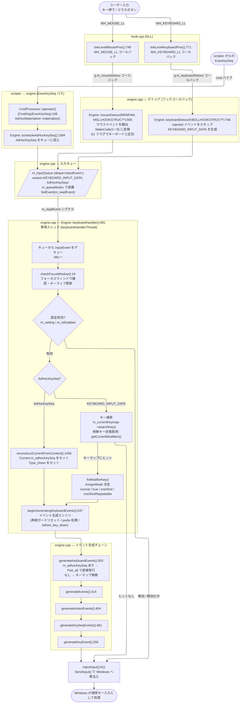
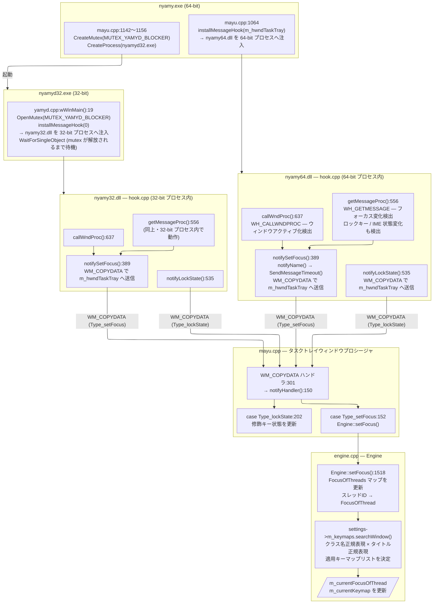
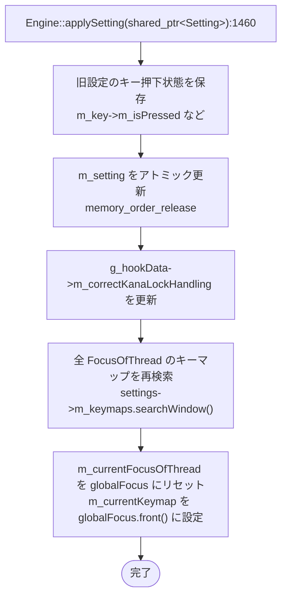
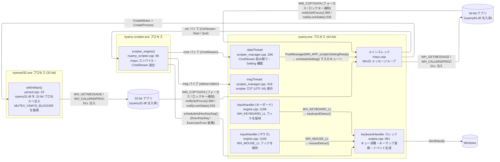

# Engine イベント処理フロー

Engine を中心としたキーボード/マウスイベントの処理フローと、設定再読み込みフローを示す。

---

## 1. キーボード/マウス入力フロー



### 擬似マウス MakeCode 対応表

| MakeCode | 意味 |
|----------|------|
| 1 | 左クリック |
| 2 | 右クリック |
| 3 | 中クリック |
| 4 | ホイール上 |
| 5 | ホイール下 |
| 6 | XButton1 |
| 7 | XButton2 |
| 8 | 水平ホイール左 |
| 9 | 水平ホイール右 |

### ExecKeySeq と通常キーの処理比較

| 処理 | 通常キー | ExecKeySeq |
|------|----------|-----------|
| キューの型 | `KEYBOARD_INPUT_DATA` | `AdHocKeySeq` |
| キーマップ検索 | `searchKey()` で実施 | `m_adhocKeySeq` オーバーライドでスキップ |
| 再帰ガードリセット | `beginGeneratingKeyboardEvents` で実施 | 同上 (共有) |
| `before_key_down` 発火 | `beginGeneratingKeyboardEvents` で実施 | 同上 (共有) |
| prefix キー状態管理 | `beginGeneratingKeyboardEvents` で実施 | 同上 (共有) |
| `m_emacsEditKillLine` リセット | `beginGeneratingKeyboardEvents` で実施 | 同上 (共有) |
| キーマップ base リセット | `beginGeneratingKeyboardEvents` で実施 | 同上 (共有) |
| modifier / oneShot 処理 | `keyboardHandler` 通常パスで実施 | 非適用 |
| `generateKeySeqEvents` の Part | Down / Up (物理押下に応じて) | `Part_all` |

---

## 2. フォーカス追跡フロー

WH_GETMESSAGE / WH_CALLWNDPROC フックは **グローバルフック** (threadId=0) であり、
フックを登録したプロセスのビット数に対応した DLL がフック対象プロセスに注入される。

- **nyamy.exe (64-bit)** が `installMessageHook()` を呼ぶ → **nyamy64.dll** が 64-bit プロセスに注入
- **nyamyd32.exe (32-bit)** が `installMessageHook(0)` を呼ぶ → **nyamy32.dll** が 32-bit プロセスに注入

どちらの DLL も同じ hook.cpp を共有しており、フォーカス変化を WM_COPYDATA で nyamy.exe へ送る。



### nyamyd32 のライフサイクル

| フェーズ | 処理 |
|--------|------|
| 起動 | `OpenMutex(MUTEX_YAMYD_BLOCKER)` が成功した場合のみ動作 (nyamy.exe が保持) |
| 動作中 | `installMessageHook(0)` → nyamy32.dll を 32-bit プロセスへグローバル注入 |
| 終了 | nyamy.exe が `ReleaseMutex()` → `WaitForSingleObject` が解除 → `uninstallMessageHook()` して終了 |

---

## 3. 設定再読み込みフロー

設定リロード時は scripter プロセスを再起動する。
`start(syms)` は `std::async` で `launchScripter(syms)` を起動し、即座に返る。
初回起動時も同じ `start(syms)` を呼ぶ（mayu.cpp:770）。

```mermaid
---
config:
  layout: elk
---
sequenceDiagram
    participant mayu as mayu.cpp<br/>(メインスレッド)
    participant sm as scripter_manager.cpp<br/>ScripterManager
    participant async as scripter_manager.cpp<br/>launchScripter() [async]
    participant dt as scripter_manager.cpp<br/>dataThread / runReader()
    participant sc as nyamy_scripter.cpp<br/>scripter_engine()
    participant eng as engine.cpp<br/>keyboardHandler() [engine スレッド]

    mayu->>sm: start(syms):95
    sm->>async: std::async → launchScripter(syms):108

    Note over async: 既存 scripter が起動中なら
    async->>sc: sendQuit() → CtrlId::Quit + ctrl パイプ close
    sc->>sc: CtrlId::Quit 受信 → ループ脱出
    async->>async: WaitForMultipleObjects<br/>(process + dataThread + msgThread)
    async->>async: closeHandles() / m_quitSent=false

    async->>sc: CreateProcess(nyamy-scripter.exe)<br/>パイプ確立 + dataThread / msgThread 起動
    async->>sc: CtrlStreamWriter::writeStart(syms)<br/>→ ctrl パイプ書き込み

    sc->>sc: ctrlReader.readNext(id):122<br/>CtrlId::Start を受信
    sc->>sc: ctrlReader.readStart():129
    sc->>sc: doCompile(syms, dataWriter):51<br/>ConfigFiles → MayuParser::parseFile()<br/>→ MayuCompiler::compile()<br/>→ CmdStreamWriter (各 Def* コマンド)
    sc->>dt: CmdStreamWriter::writeCommit()<br/>→ cmd パイプへ CmdId::Commit(0xFF) 書き込み

    dt->>dt: CmdProcessor::process():85<br/>m_builder 初期化 (Global キーマップ設定)<br/>各コマンドを std::visit で SettingBuilder に積む
    dt->>dt: CmdId::Commit 受信:268<br/>SettingBuilder::build() → Setting<br/>m_builder.reset() → ビルダー解放<br/>onCommit コールバック実行
    dt->>dt: ScripterManager::setPendingSetting():441<br/>static な単一スロットへ shared_ptr&lt;Setting&gt; を move<br/>(旧 Setting が残っていればここで解放)
    dt->>mayu: PostMessage(WM_ScripterSettingReady, 0, 0)<br/>ペイロードなし。通知が失われても<br/>スロット上書き/終了時クリアで解放される

    mayu->>mayu: WM_APP_scripterSettingReady ハンドラ:437<br/>ScripterManager::takePendingSetting()<br/>スロットが空なら何もしない
    mayu->>eng: Engine::scheduleSetting():1514<br/>入力キューへ push_back<br/>(UI スレッドはここで解放される)
    eng->>eng: keyboardHandler() でイベント境界に取り出し:1125<br/>Engine::applySetting()
```

UI スレッドで直接 `m_setting` を差し替えず、engine スレッドの入力キュー
(`InputEvent` variant) に載せてイベント境界で適用する。これにより

- キューに溜まった旧設定下のキーイベントより後に切り替わる
- `&Sync` / `&Wait` の同期中を待つ必要がなくなる (取り出し地点では
  `m_isSynchronizing` が必ず false)
- UI スレッドがメッセージループへ即座に戻るため、`&Sync` を完了させる
  メールスロット完了 APC が飢餓しない

### Engine::applySetting() の内部処理 (engine.cpp :1460)



---

## 4. スレッド構成



---

## 5. 主要関数・メソッド一覧

### hook.cpp

| 関数 | 行 | 役割 |
|------|---:|------|
| `lowLevelMouseProc()` | 749 | WH_MOUSE_LL コールバック |
| `lowLevelKeyboardProc()` | 771 | WH_KEYBOARD_LL コールバック |
| `installKeyboardHook()` | 826 | WH_KEYBOARD_LL フックを登録/解除 |
| `installMouseHook()` | 847 | WH_MOUSE_LL フックを登録/解除 |
| `installMessageHook()` | 793 | WH_GETMESSAGE + WH_CALLWNDPROC を登録 (nyamy.exe / nyamyd32.exe 共用) |
| `uninstallMessageHook()` | 812 | 上記フックを解除 |
| `notifySetFocus()` | 389 | フォーカス変化を WM_COPYDATA で nyamy.exe へ通知 |
| `notifyLockState()` | 535 | ロックキー変化を WM_COPYDATA で nyamy.exe へ通知 |

### yamyd.cpp

| 関数 | 行 | 役割 |
|------|---:|------|
| `wWinMain()` | 19 | MUTEX_YAMYD_BLOCKER を取得後 `installMessageHook(0)` で nyamy32.dll をグローバル注入。nyamy.exe が mutex を解放したら `uninstallMessageHook()` して終了 |

### engine.cpp

| 関数/メソッド | 行 | 役割 |
|-------------|---:|------|
| `Engine::checkFocusWindow()` | 19 | フォーカスウィンドウ確認・キーマップ更新 |
| `Engine::generateKeyEvent()` | 256 | キーイベント最終生成 |
| `Engine::generateEvents()` | 314 | アクションシーケンス処理 |
| `Engine::generateActionEvents()` | 404 | アクション実行 |
| `Engine::generateKeySeqEvents()` | 481 | キーシーケンス処理 |
| `Engine::generateKeyboardEvents()` | 503 | キーボードイベント生成コア。`m_adhocKeySeq` セット時はキーマップ検索をスキップし Part_all で実行 |
| `Engine::beginGeneratingKeyboardEvents()` | 537 | イベント生成エントリ (再帰ガードリセット / prefix 処理 / before_key_down・after_key_up) |
| `Engine::keyboardDetour(KBDLLHOOKSTRUCT*)` | 766 | フックコールバック → キューイング |
| `Engine::mouseDetour(WPARAM, MSLLHOOKSTRUCT*)` | 806 | マウスコールバック → 擬似キー変換 |
| `Engine::keyboardHandler()` | 981 | キュー処理メインループ (専用スレッド) |
| `Engine::applySetting()` | 1460 | 新しい Setting を適用 (engine スレッド専用) |
| `Engine::scheduleSetting()` | 1514 | Setting をキューに投入 (UI スレッドから) |
| `Engine::scheduleAdHocKeySeq()` | 1526 | AdHocKeySeq をキューに投入 |
| `Engine::reconstructCurrentFromContext()` | 1406 | TriggerInfo から Current を復元 (ExecKeySeq 用) |
| `Engine::setFocus()` | 1518 | フォーカス情報をエンジンへ反映 |

### scripter_manager.cpp

| 関数/メソッド | 行 | 役割 |
|-------------|---:|------|
| `ScripterManager::sendQuit()` | 57 | CtrlId::Quit 送信 + ctrl パイプ close (冪等) |
| `ScripterManager::collectHandles()` | 76 | プロセス + スレッドハンドルを配列に収集 |
| `ScripterManager::closeHandles()` | 85 | 全ハンドルを閉じて NULL/INVALID に初期化 |
| `ScripterManager::start(syms)` | 95 | std::async で launchScripter を起動 (再起動も兼ねる)。前回が完了していなければスキップ |
| `ScripterManager::launchScripter(syms)` | 108 | 起動済み scripter を停止後、新プロセスを起動し writeStart(syms) を送信 |
| `ScripterManager::setExecKeySeqCallback()` | 266 | ExecKeySeq 受信時のコールバックを登録 |
| `ScripterManager::execUserFunc()` | 272 | ExecUserFunc を scripter へ送信 |
| `ScripterManager::dataThread()` | 286 | CmdStream 読み取りスレッドエントリ |
| `ScripterManager::runReader()` | 293 | CmdProcessor でパイプを消費 |
| `ScripterManager::setPendingSetting()` | 42 | 完成した Setting を static な単一スロットへ move (旧 Setting はここで解放) |
| `ScripterManager::takePendingSetting()` | 50 | スロットから Setting を取り出す。空なら空ポインタ |
| `ScripterManager::clearPendingSetting()` | 56 | スロットを解放 (`~ScripterManager()` から呼ばれる) |
| `ScripterManager::msgThread()` | 318 | scripter ログ読み取りスレッドエントリ |

### nyamy_scripter.cpp (scripter/)

| 関数 | 行 | 役割 |
|------|---:|------|
| `doCompile()` | 51 | .mayu コンパイル + CmdStream 書き出し |
| `scripter_engine()` | 85 | DLL エクスポート・CtrlStream ループ (Start / Quit / ExecUserFunc を処理) |

### cmd_processor.cpp

| 関数/メソッド | 行 | 役割 |
|-------------|---:|------|
| `CmdProcessor::onCommit()` | 51 | Commit コールバック登録 |
| `CmdProcessor::process()` | 85 | m_builder 初期化 + CmdStream 読み取り・Setting 構築ループ |
| `CmdProcessor::operator()(CmdArgsExecKeySeq)` | 106 | ExecKeySeq をマテリアライズして ExecKeySeq コールバックへ |
| `CmdProcessor::operator()(CmdArgsCommit)` | 268 | build() → m_builder.reset() → onCommit コールバック |

### mayu.cpp

| 箇所 | 行 | 役割 |
|------|---:|------|
| `WM_APP_scripterSettingReady` 定義 | 92 | メッセージ ID 定数 (`ScripterManager::WM_ScripterSettingReady` から導出) |
| `WM_APP_scripterSettingReady` ハンドラ | 437 | `ScripterManager::takePendingSetting()` で Setting 受け取り → `Engine::scheduleSetting()` で engine スレッドへ委譲 |
| `WM_COPYDATA` ハンドラ | 301 | hook DLL からのフォーカス/ロックキー通知を受信 → `notifyHandler()` |
| `notifyHandler()` | 150 | Notify 種別に応じて `Engine::setFocus()` などを呼び出し |
| `m_scripter->start(syms)` | 771 | 初回起動時・リロード時に scripter を (再)起動 |
| nyamyd32 起動 | 1143〜1157 | `CreateMutex(MUTEX_YAMYD_BLOCKER)` + `CreateProcess("nyamyd32")` |
