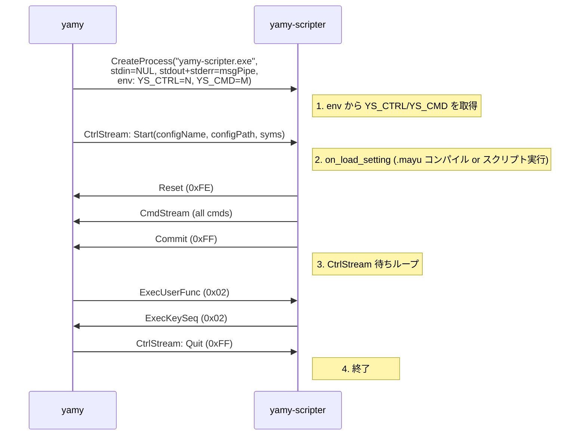
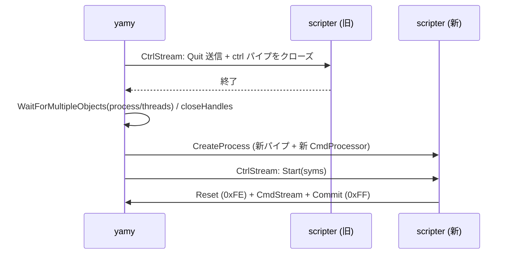

# バイナリプロトコル仕様

## 概要

yamy ↔ yamy-scripter 間の通信は **4 本のハンドル** で行う。

| チャネル | 方向 | 渡し方 | 内容 |
|--------|------|--------|------|
| ctrl パイプ | yamy → scripter | 環境変数 `YS_CTRL` (継承ハンドル番号) | CtrlStream (バイナリ) |
| cmd パイプ | scripter → yamy | 環境変数 `YS_CMD` (継承ハンドル番号) | CmdStream (バイナリ) |
| msg パイプ | scripter → yamy | STARTUPINFO (stdout+stderr をマージ) | ログ出力 (テキスト) |
| NUL | — | STARTUPINFO stdin | 即 EOF |

**stdin/stdout/stderr はバイナリプロトコルに使用しない。**
これにより、scripter 実装側が `printf` / `std::cout` / `puts` 等を使っても
CmdStream を汚染しない。

共通規則 (バイナリストリーム):
- すべての整数はリトルエンディアン
- 文字列は `U16 長さ (文字数)` + `UTF-16LE 文字列` (null 終端なし)

---

## プロセス起動とハンドル継承

yamy 側 (`ScripterManager::launchScripter()`) の処理:

```cpp
// パイプ生成 (sa.bInheritHandle = TRUE で子プロセスに継承可能)
CreatePipe(&hCtrlRead,   &m_hCtrlWrite, &sa, 0);  // ctrl
CreatePipe(&m_hDataRead, &hDataWrite,   &sa, 0);  // cmd (data)
CreatePipe(&m_hMsgRead,  &hMsgWrite,    &sa, 0);  // msg (log)
hNul = CreateFile(L"NUL", GENERIC_READ, ..., &sa, ...);  // stdin 代替

// yamy 側ハンドルは子プロセスに継承させない
SetHandleInformation(m_hCtrlWrite, HANDLE_FLAG_INHERIT, 0);
SetHandleInformation(m_hDataRead,  HANDLE_FLAG_INHERIT, 0);
SetHandleInformation(m_hMsgRead,   HANDLE_FLAG_INHERIT, 0);
SetHandleInformation(hNul,         HANDLE_FLAG_INHERIT, 0);
// hCtrlRead, hDataWrite, hMsgWrite は継承可能 (sa.bInheritHandle=TRUE)

// 環境変数ブロックにハンドル番号を設定
wchar_t ctrlVal[32], cmdVal[32];
swprintf_s(ctrlVal, L"%llu", (unsigned long long)(uintptr_t)hCtrlRead);
swprintf_s(cmdVal,  L"%llu", (unsigned long long)(uintptr_t)hDataWrite);
// YS_CTRL=ctrlVal, YS_CMD=cmdVal を先頭に持つ環境ブロックを構築 (既存 env をマージ)

// コマンドライン (ハンドル引数なし)
swprintf_s(cmdLine, L"\"%s\"", scripterPath.c_str());

// stdin=NUL, stdout+stderr=msgパイプ
si.hStdInput  = hNul;
si.hStdOutput = hMsgWrite;
si.hStdError  = hMsgWrite;  // 同じパイプにマージ

CreateProcess(NULL, cmdLine, NULL, NULL, TRUE, CREATE_UNICODE_ENVIRONMENT, envBlock, NULL, &si, &pi);
```

scripter 側 (`ys_start()` 内) の処理:

```cpp
// 環境変数 YS_CTRL / YS_CMD からハンドルを復元
wchar_t buf[32];
GetEnvironmentVariableW(L"YS_CTRL", buf, 32);
HANDLE hCtrlRead  = reinterpret_cast<HANDLE>(static_cast<uintptr_t>(wcstoull(buf, nullptr, 10)));
GetEnvironmentVariableW(L"YS_CMD", buf, 32);
HANDLE hDataWrite = reinterpret_cast<HANDLE>(static_cast<uintptr_t>(wcstoull(buf, nullptr, 10)));

// stderr を UTF-16 に設定 (wcerr 経由のログを yamy が wchar_t 単位で読む)
_setmode(_fileno(stderr), _O_U16TEXT);

// 継承ハンドルを streambuf でラップ
PipeReadStreambuf  ctrlBuf(hCtrlRead);
PipeWriteStreambuf dataBuf(hDataWrite);
std::istream ctrlStream(&ctrlBuf);
std::ostream dataStream(&dataBuf);

CtrlStreamReader ctrlReader(ctrlStream);
CmdStreamWriter  dataWriter(dataStream);
// ... CtrlStream ループ
```

---

## msg パイプ (ログ)

scripter の stdout と stderr を 1 本のパイプにマージして yamy がログとして受信する。

- scripter 側: stderr に `_O_U16TEXT` を設定 → `std::wcerr` 出力が UTF-16 LE になる
- yamy 側: `PipeReadWStreambuf` (wchar_t = 2 バイト単位読み取り) で受信
- stdout に書き込まれたバイト列もこのパイプに流れるが、scripter が `std::cout` 等をログ目的で使う場合は UTF-16 でないと文字化けする

---

## CtrlStream (yamy → scripter)

### 現在の実装

| コマンド | ID | 状態 |
|---------|-----|------|
| Start | 0x01 | 使用中 (シンボルセット送信、起動時) |
| ExecUserFunc | 0x02 | 使用中 (ユーザー定義関数呼び出し) |
| Quit | 0xFF | 使用中 |

### コマンド ID (現状)

```cpp
enum class CtrlId : uint8_t {
    Start        = 0x01,  ///< (Re)compile with symbols; sent on every scripter startup
    ExecUserFunc = 0x02,  ///< Engine -> scripter: invoke user-defined function
    Quit         = 0xFF,  ///< Terminate scripter
};
```

### Start (0x01)

```
[0x01]
[n_syms : U16]
[sym0   : String]
...
[symN   : String]
```

### ExecUserFunc (0x02)

```
[0x02]
[func_name : String]
[n_args    : U16]
[arg0      : FuncArg]
...
[argN      : FuncArg]
[context   : TriggerInfo]
```

### Quit (0xFF)

```
[0xFF]
```

### 将来の変更 (未実装、プロセス再起動方式)

プロセス再起動方式では、シンボルは argv (`-D` フラグ) で渡すため `Start (0x01)` が不要になる。
`ExecUserFunc (0x02)` と `Quit (0xFF)` のみ残る。

| コマンド | 現在 | 将来 |
|---------|------|------|
| Start | 0x01 (シンボルセット送信) | **廃止** (シンボルは argv で渡す) |
| ExecUserFunc | 0x02 | 0x02 (変更なし) |
| Quit | 0xFF | 0xFF (変更なし) |

#### TriggerInfo バイナリレイアウト

`TriggerInfo` のバイナリシリアライズ形式は `ctrl_stream_writer.cpp` / `ctrl_stream_reader.cpp` を参照。

---

## CmdStream (scripter → yamy)

### 現在の実装

CmdStream のコマンドは用途で 2 系統に分かれる (ID 定義は下記 enum を参照)。

| 系統 | コマンド | 用途 |
|------|---------|------|
| 設定構築 | `Reset` / `RegKeySeq` / `Def*` / `BeginKeymap` / `Assign*` / `Commit` | on_load_setting で構築した設定を Engine へ送出 |
| ランタイム | `ExecKeySeq` (0x02) | `ys_exec_keyseq` による adhoc キーシーケンス実行要求 |

**設定定義ブロック**: 設定構築コマンドは `Reset` (0xFE) で開始し `Commit` (0xFF) で
完了する。consumer (CmdProcessor) は `Reset` で新しい Setting の構築を開始し
(構築途中の Setting があれば破棄)、`Commit` で参照解決を行って完成させる。
keyseq の内容と substitute の解決は `Commit` 受信時まで遅延されるため、
ブロック内のキー定義・keyseq・keymap の順序は不問 (keyseq を index で参照する
コマンドより先に対応する `RegKeySeq` を送る必要があるのみ)。
エラー発生時は `Commit` を書かずに終了し、次のブロックの `Reset` が
書き残しを破棄する。`ExecKeySeq` は最後に `Commit` された Setting に対して動作する。

### コマンド ID

```cpp
enum class CmdId : uint8_t {
    RegKeySeq   = 0x01,
    ExecKeySeq  = 0x02,
    DefKey      = 0x10,
    DefMod      = 0x11,
    DefSync     = 0x12,
    DefAlias    = 0x13,
    DefSubst    = 0x14,
    DefOption   = 0x15,
    DefSymbol   = 0x16,
    BeginKeymap = 0x20,
    AssignKey   = 0x21,
    AssignEvent = 0x23,
    AssignMod   = 0x24,
    Reset       = 0xFE,
    Commit      = 0xFF,
};
```

---

## プロセスライフサイクル

### 起動シーケンス (実装済み)



### 設定再読み込み (実装済み、プロセス再起動方式)

再読み込みは `mayu.cpp load()` → `ScripterManager::start()` → `launchScripter()` で
行う。`launchScripter()` は既存プロセスを終了させ、**パイプ3本とデータ受信スレッド
(CmdProcessor を含む) もすべて作り直す**。パイプの再利用はない。



補足: `ys_start()` のループは同一プロセスへの複数回 Start も処理できる
(consumer 側も Reset ごとに新しい Setting の構築を開始するため成立する)。
本番の再読み込みはプロセス再起動方式であり、この経路はテストハーネス
(`buildSetting(..., loadCount)`) が使用する。
